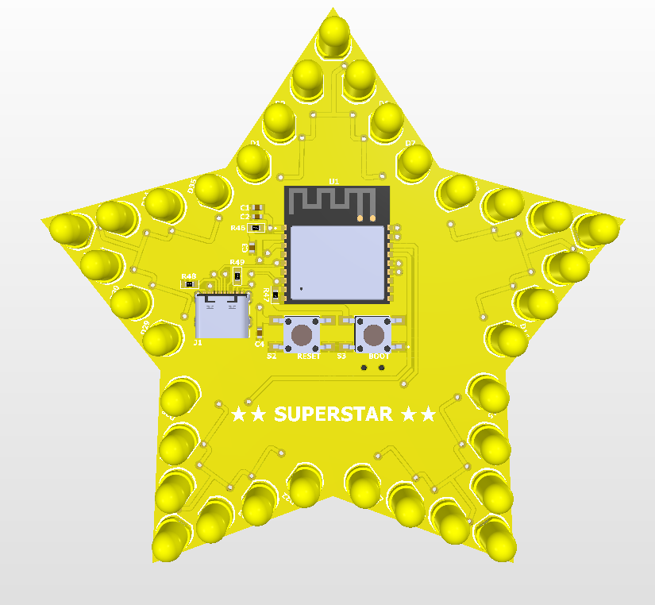
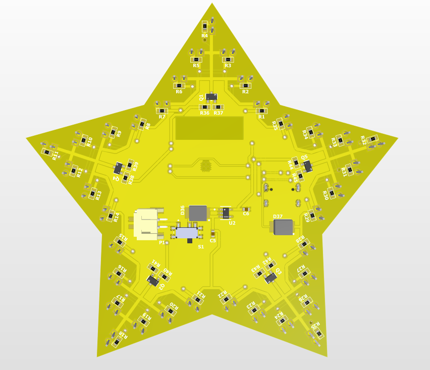

# ⭐️ ESP32 Star Matrix Hardware System

A custom-shaped, geometric PCB design engineered to drive a 35-LED matrix utilizing an ESP32 microcontroller. This project showcases hardware development capabilities from schematic capture and component selection to high-density surface-mount technology (SMT) routing.

##  3D Design Preview

  
  

<em>Figure 1: Complete 3D CAD models generated via Altium Designer.</em>

---

##  Technical Specifications & Architecture
* **Core Microcontroller:** ESP32 MCU (selected for high GPIO availability and processing capacity).
* **Display Integration:** 35 surface-mount LEDs arranged in an optimized geometric star matrix.
* **EDA Software Platform:** Altium Designer.
* **Design Implementation:** Integrated decoupling capacitor arrays for high-frequency noise mitigation, custom board boundary geometry definitions, and calculated trace width variations tailored for signal and power rails.

---

##  Engineering Project Milestones
- [x] **Schematic Capture:** Completed circuit architecture, logical signal routing, and Electrical Rule Checks (ERC).
- [x] **PCB Layout & Routing:** Defined custom star geometry, aligned SMT footprints, and achieved 100% trace routing completeness.
- [x] **Manufacturing Preparation:** Production-ready Gerber data packages and NC Drill files fully generated.
- [ ] **Hardware Population:** Surface-mount technology component population and reflow soldering pending.
- [ ] **Firmware Architecture:** Bare-metal C matrix driving algorithms and basic animation sequences to be implemented.

---

## 📂 Repository Layout
* `/design`: Source design files, including Altium schematic (`.SchDoc`) and layout (`.PcbDoc`).
* `/manufacturing`: Complete production-ready manufacturing packages.
